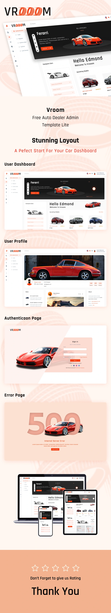

### Introduction

This is [Vroom-Dashboard](https://templates.iqonic.design/lite/vroom/html/dist/dashboard/) in Vue Js.

The project is helpful to start your next project, as it provides a lot of the common tools you may reach for, all ready to go.



### Features

- Vue Router Included.
- Vuex.
- Bootstrap 5.
- Modules/Components organized across folders.
- Base pages (like Dashboard/404 etc).
- Pre-configured with code quality tools: Prettier, Jest, etc.
- Axios Interceptors.
- [Notifcations](https://github.com/dafcoe/vue-notification).

### Installation

```console
npm install
cp .env.example .env
npm run dev
```
### Demo

This is [DEMO](https://6203a01ada891618a460af21--vigilant-ramanujan-b18003.netlify.app/admin/dashboard)
# mobile
"# Vue-Vroom-Dashboard" 
